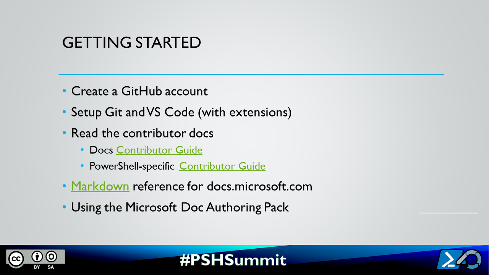

<!-- markdownlint-disable MD041 -->

Create a GitHub account

Setup Git and VS Code (with extensions)

Read the contributor docs

- Docs Contributor Guide
- PowerShell-specific Contributor Guide

Markdown reference for docs.microsoft.com

Using the Microsoft Doc Authoring Pack
