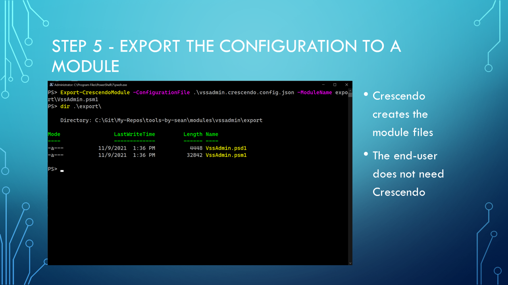

<!-- markdownlint-disable MD041 -->

1. Delete the module from the export folder
1. Export the module
1. Switch to PS 5.1 - show that VSSAdmin and Crescendo are not loaded
1. Import VSSAdmin and run some commands
