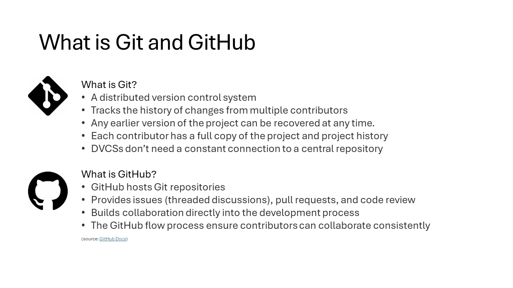

<!-- markdownlint-disable MD041 -->

## What is Git?

Git is a distributed version control system, or DVCS, that tracks the history of changes as people
and teams collaborate on projects together. As developers make changes to the project, any earlier
version of the project can be recovered at any time. In a DVCS, every developer has a full copy of
the project and project history. Unlike once popular centralized version control systems, DVCSs
don't need a constant connection to a central repository.

## What is GitHub?

GitHub hosts Git repositories and provides developers with tools to ship better code through command
line features, issues (threaded discussions), pull requests, and code review. GitHub builds
collaboration directly into the development process. Work is organized into repositories where
developers can outline requirements or direction and set expectations for team members. Then, using
the GitHub flow, developers simply create a branch to work on updates, commit changes to save them,
open a pull request to propose and discuss changes, and merge pull requests once everyone is on the
same page.

(source: [GitHub Docs](https://docs.github.com/en/get-started/using-git/about-git))
