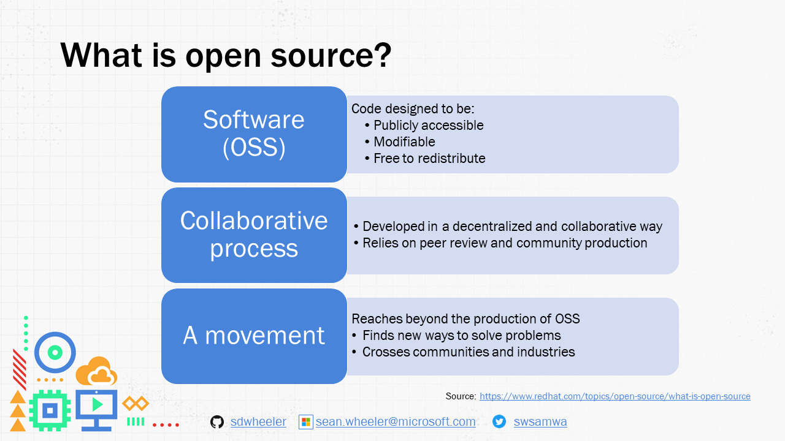

<!-- markdownlint-disable MD041 -->

Open source is a term that originally referred to open source software (OSS). Open source software
is code that is designed to be publicly accessible—anyone can see, modify, and distribute the code
as they see fit.

Open source software is developed in a decentralized and collaborative way, relying on peer review
and community production. Open source software is often cheaper, more flexible, and has more
longevity than its proprietary peers because it is developed by communities rather than a single
author or company.

Open source has become a movement and a way of working that reaches beyond software production. The
open source movement uses the values and decentralized production model of open source software to
find new ways to solve problems in their communities and industries.
