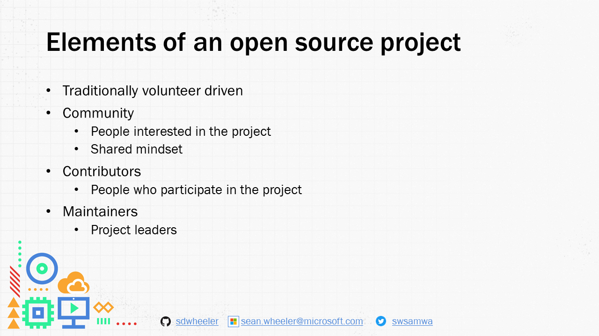

<!-- markdownlint-disable MD041 -->

Traditionally volunteer driven

Community
- People interested in the project
- Shared mindset

Contributors
- People who participate in the project

Maintainers
- Project leaders
