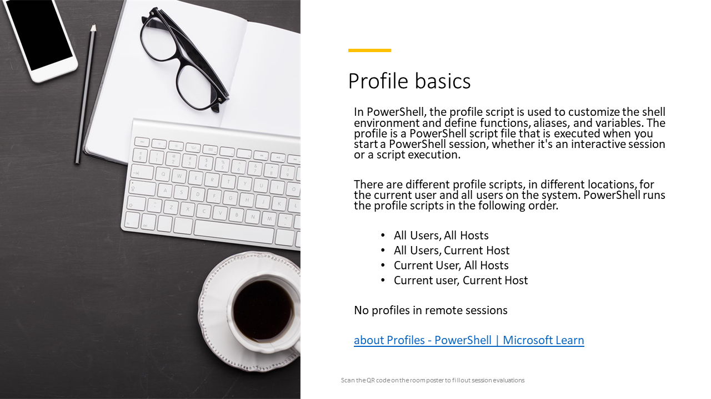

<!-- markdownlint-disable MD041 -->


In PowerShell, the profile script is used to customize the shell environment and define functions,
aliases, and variables. The profile is a PowerShell script file that is executed when you start a
PowerShell session, whether it's an interactive session or a script execution.

There are different profile scripts, in different locations, for the current user and all users on
the system. PowerShell runs the profile scripts in the following order.

- All Users, All Hosts
- All Users, Current Host
- Current User, All Hosts
- Current user, Current Host

Use the following command to see the list of profiles scripts and locations.

```powershell
$profile | Select-Object *
```

On Windows:

```Output
AllUsersAllHosts       : C:\Program Files\PowerShell\7-preview\profile.ps1
AllUsersCurrentHost    : C:\Program Files\PowerShell\7-preview\Microsoft.PowerShell_profile.ps1
CurrentUserAllHosts    : C:\Users\sewhee\Documents\PowerShell\profile.ps1
CurrentUserCurrentHost : C:\Users\sewhee\Documents\PowerShell\Microsoft.PowerShell_profile.ps1
Length                 : 69
```

On Linux:

```Output
AllUsersAllHosts       : /opt/microsoft/powershell/7/profile.ps1
AllUsersCurrentHost    : /opt/microsoft/powershell/7/Microsoft.PowerShell_profile.ps1
CurrentUserAllHosts    : /home/sdwheeler/.config/powershell/profile.ps1
CurrentUserCurrentHost : /home/sdwheeler/.config/powershell/Microsoft.PowerShell_profile.ps1
Length                 : 67
```
PowerShell doesn't load profiles from remote sessions. If you are in a remote interactive session
you can dot-source the profile script to load it.

```powershell
. $profile
```

For more information, see [about_Profiles](https://learn.microsoft.com/powershell/module/microsoft.powershell.core/about/about_profiles).
