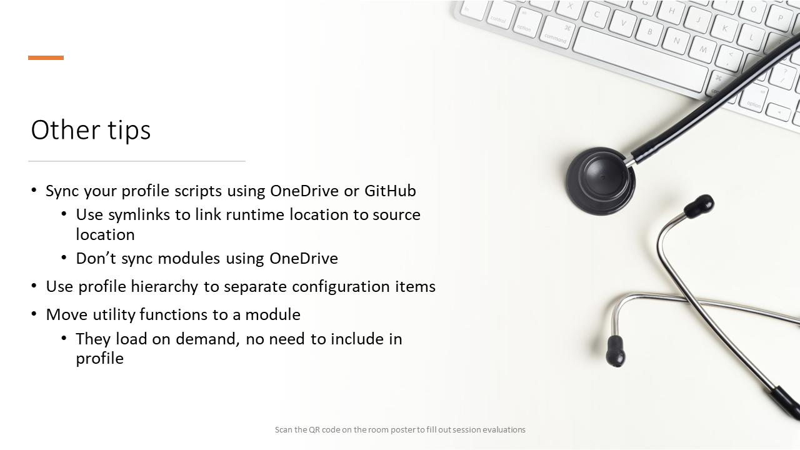

<!-- markdownlint-disable MD041 -->

- Sync your profile scripts using OneDrive or GitHub
  - Use symlinks to link runtime location to source location
  - Don't sync modules using OneDrive
- Use profile hierarchy to separate configuration items
- Move utility functions to a module
  - They can be loaded on demand, no need to include in profile
