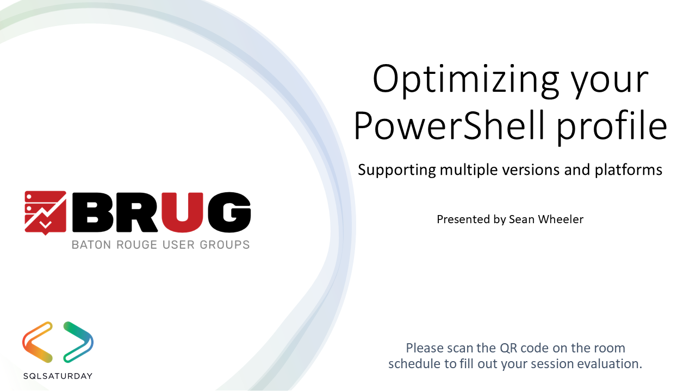

<!-- markdownlint-disable MD041 -->

PowerShell runs across multiple OS platforms and multiple versions on Windows. It can be difficult
to manage your profile scripts across the different platforms and versions. Not all features are
available on all platforms or in multiple versions.

In this presentation I show you how to create a single profile script that is version and platform
aware, and configures your PowerShell environments the same across all platforms.

This presentation was delivered at
[SQL Saturday #1016 - Baton Rouge 2023-07-29](https://sqlsaturday.com/2023-07-29-sqlsaturday1060/).
