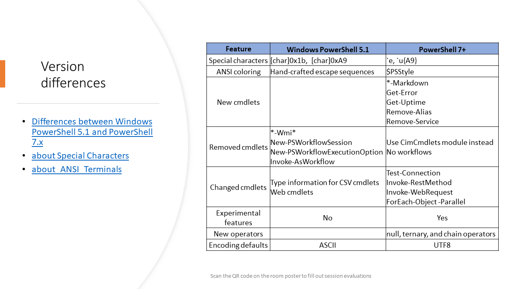

<!-- markdownlint-disable MD041 -->

## Differences between PowerShell 7 and Windows PowerShell 5.1

- PowerShell 7 has new character codes for Escape and any Unicode character
- PowerShell 7 has enhanced support for ANSI escape sequence handling in the console
- PowerShell 7 has several new cmdlets that aren't available in Windows PowerShell 5.1
- PowerShell 7 is missing several cmdlets that are available in Windows PowerShell 5.1
- The behavior of some cmdlets has changed in PowerShell 7
- PowerShell 7 has new experimental features
- PowerShell 7 has new operators that aren't available in Windows PowerShell 5.1
- PowerShell 7 has defaults to UTF-8 encoding for all output

## Related articles

- [Differences between Windows PowerShell 5.1 and PowerShell 7.x](https://learn.microsoft.com/powershell/scripting/whats-new/differences-from-windows-powershell)
- [about Special Characters](https://learn.microsoft.com/powershell/module/microsoft.powershell.core/about/about_special_characters)
- [about_ANSI_Terminals](https://learn.microsoft.com/powershell/module/microsoft.powershell.core/about/about_ANSI_Terminals)
- [Using Experimental Features in PowerShell](https://learn.microsoft.com/powershell/scripting/learn/experimental-features)
