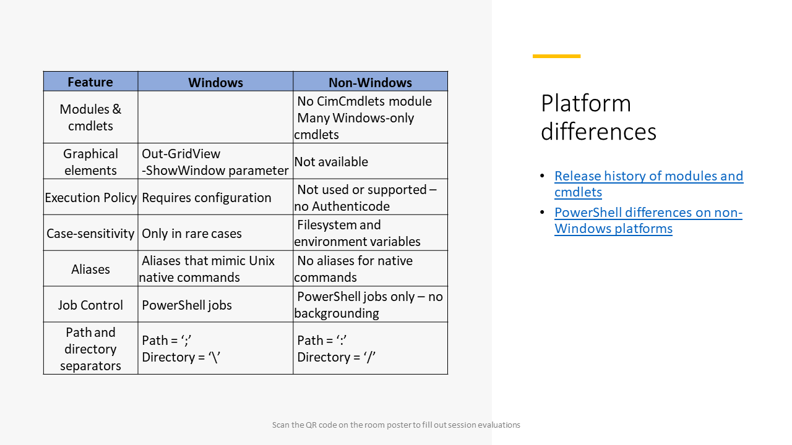

<!-- markdownlint-disable MD041 -->

## Differences between PowerShell 7 on Windows and non-Windows platforms

- PowerShell on Windows has several modules that aren't available on non-Windows platforms
- Non-Windows platforms don't support graphical features like `Out-GridView` and
  `Get-Help -ShowWindow`
- Non-Windows platforms don't support Authenticode or the PowerShell execution policy
- Non-Windows platforms are case-sensitive
- PowerShell on Windows has several aliases that mimic native commands on non-Windows platforms
- PowerShell doesn't support Linux-style background jobs
- PATH and directory separator characters are different

## Related articles

- [Release history of modules and cmdlets](https://learn.microsoft.com/powershell/scripting/whats-new/cmdlet-versions)
- [PowerShell differences on non-Windows platforms](https://learn.microsoft.com/powershell/scripting/whats-new/unix-support)
